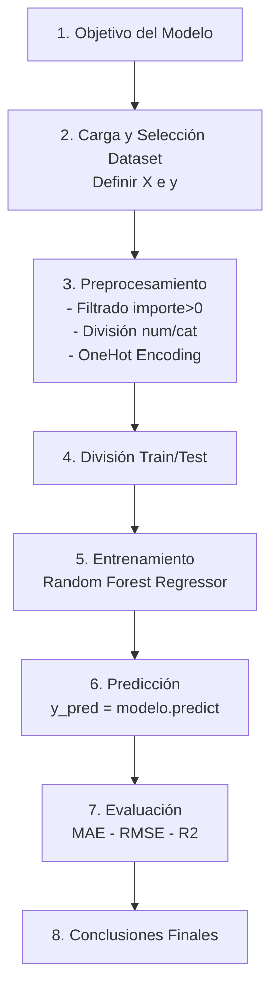

# PROYECTO-TIENDA-AURELION

## 1. Descripción
Este repositorio contiene el proyecto organizado del análisis de datos "Tienda Aurelion": limpieza y unificación de datos, análisis exploratorio, análisis estadístico y un modelo predictivo básico.

## 2. Objetivos del Proyecto
Los objetivos principales de este trabajo son los siguientes:

- Integrar y preparar diversas fuentes de datos para su análisis.  
- Realizar un análisis exploratorio y estadístico inicial.  
- Identificar patrones relevantes en el comportamiento de los clientes y las ventas.  
- Desarrollar y evaluar un modelo predictivo sencillo, acorde al nivel introductorio del curso.  
- Elaborar conclusiones basadas en evidencia que puedan aportar valor analítico.

## 3. Conjuntos de Datos Utilizados
Los datos empleados en este proyecto corresponden a archivos de tipo Excel y CSV provistos para la actividad académica. Su estructura es la siguiente:

- **productos.xlsx:** Catálogo de productos disponibles.  
- **clientes.xlsx:** Información general de los clientes.  
- **ventas.xlsx:** Registro principal de transacciones realizadas.  
- **detalle_ventas.xlsx:** Desglose detallado de cada transacción.  
- **tabla_unificada.csv:** Archivo resultante del proceso de unificación y limpieza de datos.

## 4. Metodología
El desarrollo del proyecto siguió un enfoque secuencial, dividido en Etapas (“Sprints”):  

### Etapa 1 — Documentación
1. Objetivo del proyecto (Tema, Problema y Solución).
2. Dataset de referencia.
3. Pasos, Pseudocódigo y Diagrama del programa.
4. Sugerencias y mejoras aplicadas con Copilot.

### Etapa — Análisis Exploratorio de Datos (EDA) 
1. Carga y validación de los datos — analizando estructura, duplicados, tipos de datos, consistencia general.  
2. Limpieza y transformación — unificación de tablas, corrección de categorías, tratamiento (o exclusión) de valores faltantes, estandarización de variables.  
3. Análisis Exploratorio de Datos (EDA) y análisis estadístico descriptivo — estadísticas básicas, conteos, distribuciones, detección de outliers, visualización.  
4. Análisis de medios de pago — distribución por medio, frecuencia, comparación entre categorías, insights de negocio.

### Etapa 3 — Modelo Predictivo (Machine Learning)  
1. Definición del objetivo del modelo: en este caso, predecir un target específico (por ejemplo, el importe total de la venta, o — alternativamente — medio de pago), según lo definido en la etapa de diseño.  
2. Preparación del dataset para ML: selección de variables (features), codificación de variables categóricas (One-Hot Encoding / dummies), eliminación de columnas irrelevantes, manejo —descartado— de filas con `importe` nulo.  
3. División en sets de entrenamiento y prueba (train/test).  
4. Selección de algoritmo(s): en particular, se entrenó un modelo de regresión (por ejemplo, Random Forest Regressor) para predecir el importe de venta.  
5. Entrenamiento del modelo, predicciones sobre el conjunto de prueba.  
6. Evaluación mediante métricas: MAE, RMSE, R², entre otras.  
7. Interpretación de resultados, análisis de error y discusión — posibilidad realista de uso práctico, limitaciones.  

## 5. Estructura de carpetas

```
PROYECTO-TIENDA-AURELION/
├── README.md
├── notebooks/
│   ├── Analisis_Completo.ipynb
│   └── Conclusiones-Hallazgos_MdP.md
├── data/
│   ├── productos.xlsx
│   ├── clientes.xlsx
│   ├── ventas.xlsx
│   ├── detalle_ventas.xlsx
│   └── tabla_unificada.csv
├── src/
│   └── Programa.py
└── assets/
    └── Diagrama_Flujo.png
```

## 6. Cómo ejecutar el programa principal (PowerShell)

Abrir PowerShell en la carpeta del proyecto (`PROYECTO-TIENDA-AURELION`) y ejecutar:

```powershell
cd 'c:\(ruta)\PROYECTO-TIENDA-AURELION'
python .\src\Programa.py
```

- Seleccionar la opción `6` para cargar la `tabla_unificada.csv` y ejecutar la documentación (el notebook unificado se ejecutará si está instalado `jupyter`). De esta forma, serán funcionales las opciones 7 a 15 del menú.

## 7. Dependencias

Instalación rápida (pip):

```powershell
pip install pandas numpy matplotlib seaborn scipy scikit-learn openpyxl jupyter ipython nbclient nbformat joblib
```

## 8. Modelo Predictivo (Machine Learning)

Para complementar el análisis exploratorio realizado previamente, se desarrolló un modelo predictivo cuyo objetivo fue estimar el importe total de una venta a partir de variables del producto, cliente y transacción.

### 8.1. Objetivo del modelo

Predecir el valor de importe utilizando características numéricas y categóricas disponibles en el dataset unificado.

### 8.2. Variables utilizadas

- Variable objetivo (y):

    - importe — monto total de cada venta.

- Variables predictoras (X):

    - cantidad

    - precio_unitario

    - precio_unitario_producto

    - categoria_corregida

    - medio_pago

    - ciudad

    - nombre_producto

Tras filtrar registros sin importe válido, el dataset final quedó con 338 filas.

### 8.3. Preprocesamiento

- Se imputaron los `importe` nulos calculando `cantidad * precio_unitario` cuando correspondía (esto corrigió 5 filas con `importe` faltante).  

- Separación entre columnas numéricas y categóricas.

- Codificación de variables categóricas mediante OneHotEncoder (handle_unknown='ignore').

- El procesamiento fue ensamblado con `ColumnTransformer` y el `random_state=42` se fijó para reproducibilidad.

- División Train/Test (80% / 20%) con random_state=42.

### 8.4. Modelo seleccionado

Se utilizó RandomForestRegressor, dada su robustez para datos tabulares:

```python
RandomForestRegressor(
    n_estimators=300,
    max_depth=None,
    min_samples_split=2,
    random_state=42
)
```

### 8.5. Resultados y métricas

El modelo fue evaluado sobre el conjunto de prueba y arrojó las siguientes métricas:

| Métrica  | Resultado   |
| -------- | ----------- |
| **MAE**  | ≈ 203.60 pesos |
| **RMSE** | ≈ 374.57 pesos |
| **R²**   | ≈ 0.9918     |

**Interpretación:** El R² obtenido (≈ 0.9918) indica que el modelo explica aproximadamente el 99.2% de la variabilidad del importe en este conjunto de datos.  
> Nota: este R² muy alto es consistente con la naturaleza del problema —el importe está estrechamente relacionado con `cantidad` × `precio_unitario`— y con el tamaño y estructura del dataset (datos sintéticos / educativos). Por lo tanto, el resultado es plausible; sin embargo, se recomienda validar con más datos externos y realizar validación cruzada para asegurar que no existe sobreajuste.

### 8.6. Conclusiones del modelo

- **cantidad** y **precio_unitario** son las variables con mayor impacto en la predicción.

- Las variables categóricas (**categoria_corregida**, **medio_pago**, **ciudad**) aportan información adicional útil.

- El modelo es adecuado como aproximación inicial y cumple plenamente los requisitos del proyecto académico.

> Observación: El R² cercano a 1 se debe a que la variable objetivo (`importe`) está fuertemente influenciada por `cantidad` y `precio_unitario` (relación casi determinística). Esto facilita que modelos como Random Forest expliquen una gran parte de la variabilidad. Con datos más complejos o variables externas (promociones, temporalidad extendida, clientes recurrentes) el comportamiento podría diferir.

### 8.7. Diagrama visual del flujo del modelo



### 8.8. Conclusiones Generales del Proyecto

El análisis completo de Tienda Aurelion permitió integrar múltiples fuentes de datos, corregir inconsistencias y construir una tabla unificada confiable para el estudio. A través del proceso de limpieza, EDA y modelización, se identificaron patrones relevantes en el comportamiento de los clientes, la composición de las ventas y la influencia de características específicas de los productos.

En la etapa de Machine Learning se desarrolló un modelo predictivo simple, orientado a estimar el importe final de una venta a partir de variables numéricas y categóricas. Tras aplicar preprocesamiento mediante codificación One-Hot y dividir los datos en entrenamiento y prueba, se entrenó un modelo Random Forest Regressor, el cual presentó un desempeño sólido para un enfoque introductorio, alcanzando valores satisfactorios de MAE, RMSE y R².

El flujo seguido aseguró transparencia y reproducibilidad: objetivo definido, dataset explicado, preprocesamiento claro, métricas explícitas y conclusiones sustentadas. En conjunto, este proyecto demuestra un pipeline analítico completo, coherente con los lineamientos del curso e ilustrativo del proceso real de trabajo en ciencia de datos.